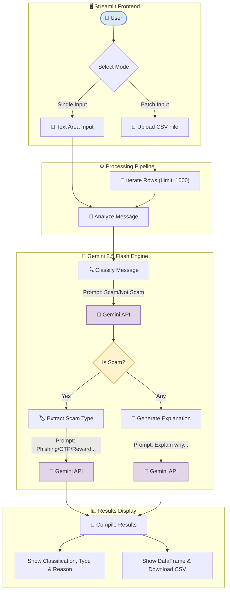

# ScamGuard AI

ScamGuard AI is an advanced AI-powered scam message detection platform that leverages Google Gemini large language models (LLMs) to analyze, classify, and explain scam messages effectively.

## Features

- **Message Classification:** Automatically classifies messages into Scam, Not Scam, or Uncertain.
- **Scam Type Identification:** Detects specific scam types such as phishing, OTP fraud, fake rewards, fake authority impersonations, and others.
- **Explainability:** Provides detailed explanations on why a message is classified as scam or not scam.
- **Interactive Streamlit Interface:** Enables real-time message analysis and batch CSV file processing.
- **Batch Processing Support:** Process datasets efficiently with configurable batch size to respect API quotas.
- **Modular and Extensible:** Designed for easy enhancement with additional scam detection and processing logic.



## Getting Started

### Prerequisites

- Python 3.12 or higher
- Google Gemini API key (obtain from Google Cloud Console)
- Recommended: Python virtual environment tools (venv)

### Installation

1. Clone the repository

    ```
    git clone https://github.com/ergaikwadketan/scamguard-ai.git
    cd scamguard-ai
    ```

2. Set up virtual environment

    ```
    python -m venv venv
    ```

3. Activate virtual environment

    - On Windows:
      ```
      venv\Scripts\activate
      ```
    - On Mac/Linux:
      ```
      source venv/bin/activate
      ```

4. Install dependencies

    ```
    pip install -r requirements.txt
    ```

5. Create a `.env` file in the project root and add your Gemini API key

    ```
    GEMINI_API_KEY=your_gemini_api_key_here
    ```

## Usage

### Streamlit Web Application

Run the interactive user interface:

streamlit run app.py


Open your web browser at `http://localhost:8501` to analyze messages individually or upload CSV files for batch processing.

### Command Line Batch Processing

Analyze messages from a CSV file via CLI:

python pipeline.py


The default input file is `dataset.csv` and outputs results to `scam_analysis_results.csv`.

## Project Structure

- `llm_utils.py` - Core logic for calling the Gemini API, performing classification, scam type detection, and explanation generation.
- `app.py` - Streamlit web app for user interaction.
- `pipeline.py` - Batch processing of CSV files for large scale message evaluations.
- `data_utils.py` - Optional utility for reading and validating datasets.
- `.env` - Store API keys securely (not committed to Git).
- `.gitignore` - Specifies files/folders to exclude from version control.

## Contributing

Contributions to improve ScamGuard AI are welcome! Please fork the repository and submit pull requests.

## License

This project is licensed under the MIT License. See the [LICENSE](LICENSE) file for details.

---

© 2025 Ketan Dilip Gaikwad
